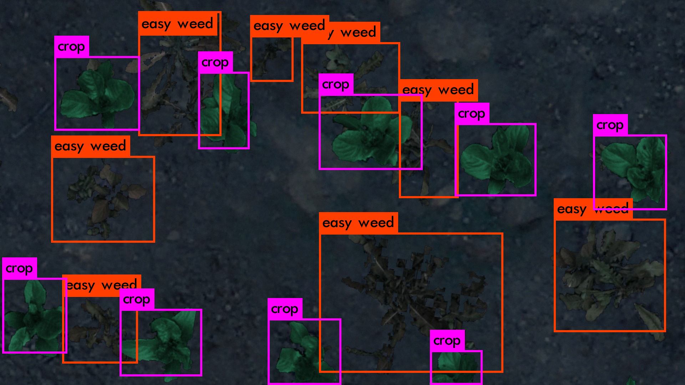

<!-- PROJECT LOGO -->
<br />
  <h1 align="center">Autonomous Robotic Weeding</h3>


<!-- TABLE OF CONTENTS -->
<details open="open">
  <summary>Table of Contents</summary>
  <ol>
      <li><a href="#Chosen-Area">Chosen Area</a></li>
    <li><a href="#Solution">Solution</a></li>
    <li>
      <a href="#Getting-Started">Getting Started</a>
      <ul>
        <li><a href="#Prerequisites">Prerequisites</a></li>
        <li><a href="#Installation">Installation</a></li>
        <li><a href="#Usage">Usage</a></li>
        <li><a href='#Changing-Parameters'>Changing Parameters</a></li>
      </ul>
    </li>
  </ol>
</details>

<p align="center">

</p>

<!-- ABOUT THE PROJECT -->
## Chosen Area
This project is submitted for the University of Lincoln CMP9767M Robot Programming module. The **chosen focus area is Perception** and as such the environment uses a static simulation, with realistic planting area and a single robot.

## Solution
<a href='/catkin_ws/src/autonomous_weeding/src/camera_parser.py'>Colour thresholding</a> is used to ensure the current scene is sufficiently green to call the vision pipeline.The camera stream image is then centre-cropped and used as input to a YOLOv3 CNN. This publishes a list of bounding boxes representing the location of objects belonging to one of 4 classes: 
<ul>
    <li>Crop</li>
    <li>Easy Weed</li>
    <li>Medium Weed</li>
</ul>

A <a href='/catkin_ws/src/autonomous_weeding/src/transform_listener.py'>tf listener</a> then </a href='/catkin_ws/src/autonomous_weeding/src/vision_handler.py'>calculates the pose</a> of the camera and the spray within the map frame, the camera pose is stored in a list to which the sprayer's pose is compared, any time the positions match the spray service is executed.


Navigation is accomplished through the move_base package via a custom <a href='/catkin_ws/src/autonomous_weeding/src/movebase_client.py'>client</a> that loads the user's desired goals from file.

<!-- GETTING STARTED -->
## Getting Started

### Prerequisites
<ol>
    <li>Ensure your system is running Ubuntu 18.04.05 with Python2, ROS and OpenCV installed</li>
    <li>It is strongly recommended that this code is run on a GPU with CUDA enabled.</li>
    <li>Ensure the <a href="https://github.com/LCAS/CMP9767M">LCAS CMP9767M Ubuntu distribution is correclty installed</a></li>        
</ol>

### Installation


1. If you don't already have the code, clone the repo
   ```sh
   git clone git@github.com:Jack742/Autonomous-Weed-Detection.git
   ```
2. Navigate to Autonomous-Weed-Detection/catkin_ws
3. There should only be the src directory. Delete Build and Devel if they are present.
4. If you are **not** using a CUDA GPU, you must set GPU=0 inside catkin_ws/src/darknet_ros/darknet
5. Run catkin_make from the catkin_ws directory
6. Source the package 
    ```sh
    source devel/setup.bash
    ```
7. Alternatively, setup.bash to your ~/.bashrc


<!-- USAGE EXAMPLES -->
### Usage
To run, simply execute the following 3 commands (in different terminals):
1.  ```sh
    roslaunch uol_cmp9767m_base thorvald-sim.launch map_server:=true fake_localisation:=true
    ```
2.  ```sh
    roslaunch uol_cmp9767m_tutorial move_base.launch 
    ```
3.  ```sh
    roslaunch autonomous_weeding run_all.launch
    ```
The first two launch files simply instantiate the Thorvald simulation environment and movebase client. The final launch initialises YOLOv3, and 3 custom nodes: <a href='/catkin_ws/src/autonomous_weeding/src/vision_handler.py'>vision_handler</a>, <a href='/catkin_ws/src/autonomous_weeding/src/camera_parser.py'>camera_paser</a> and <a href='/catkin_ws/src/autonomous_weeding/src/'>movebase_client_py</a>.

### Changing Parameters
1. To change the path the robot takes, simply alter the poses found within the <a href='/catkin_ws/src/autonomous_weeding/src/cfg/goals.json'>goals.json</a> file.
2. to change YOLOv3, you weights and config files should be placed within the *darknet_ros/darknet_ros/yolo_network_config/* directory. Next, you should change the parameters within the config/yolov3.yaml file to reflect this.
3. Within the same yolov3.yaml file, one can change the prediction threshold for the network.
4. Finally, change the camera_reading topic of ros.yaml within the darknet package to subscribe to a different image stream.
<!-- CONTACT -->
## Contact

Jack Foster - [Github](https://github.com/Jack742)

## Results

The poinsettia_bracts_detection py file won the challenge to find the most bracts in an image. Written by Jack Foster [Github](https://github.com/Jack742)
